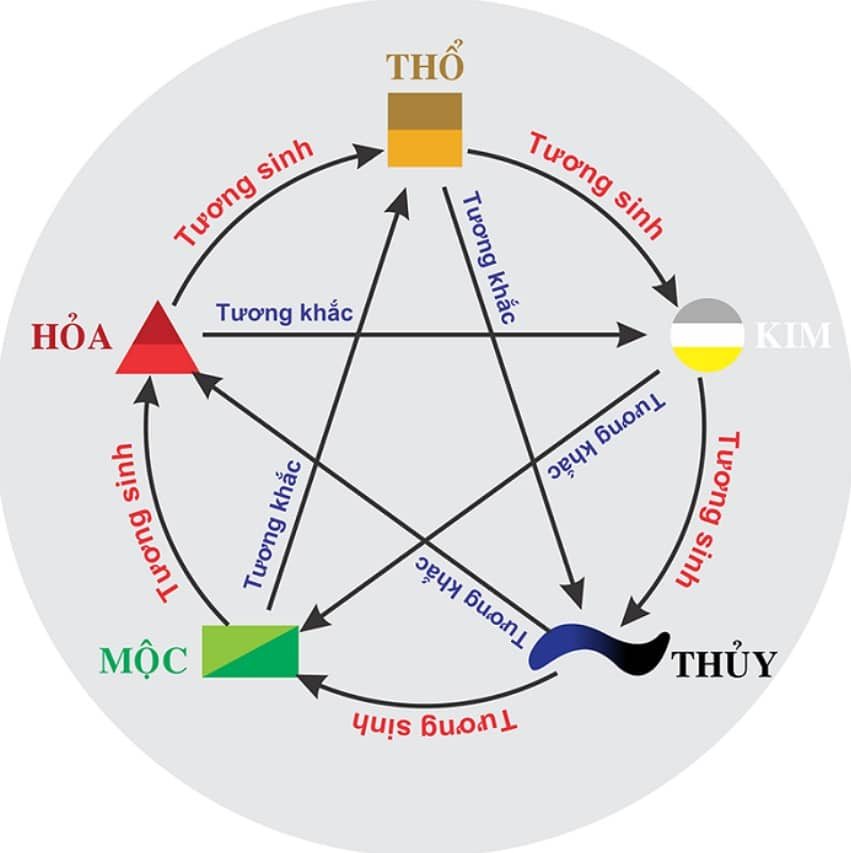

# Bộ lọc Phong thủy Số (Nâng cao)

Một ứng dụng web giúp phân tích, lọc và chấm điểm số điện thoại dựa trên các nguyên tắc phong thủy. Được xây dựng với **Rust** và **WebAssembly** để cho hiệu năng xử lý cao, cho phép phân tích hàng chục nghìn số điện thoại ngay trên trình duyệt của bạn.

**[➡️ Xem Demo trực tuyến tại đây](https://dohuyhoang93.github.io/tim-sdt-phongthuy/)**



## ✨ Tính năng chính

- **Phân tích hàng loạt:** Tải lên file `.txt` chứa danh sách số điện thoại để phân tích cùng lúc.
- **Hai chế độ phân tích:**
  - **Tương hợp Bản mệnh:** Chấm điểm và lọc số dựa trên sự tương hợp với mệnh (Kim, Mộc, Thủy, Hỏa, Thổ) của người dùng.
  - **Cân bằng tuyệt đối:** Tìm các số hiếm có đủ 5 hành và mỗi hành xuất hiện đúng 2 lần.
- **Tùy chỉnh sâu:** Cho phép tùy chỉnh điểm số và các quy tắc lọc một cách chi tiết.
- **Bộ lọc đa dạng:**
  - **Bộ lọc tĩnh:** Cân bằng Âm-Dương (chẵn-lẻ), tổng nút, yêu cầu đủ 5 hành.
  - **Bộ lọc tùy chỉnh:** Lọc theo đầu số (prefix), hậu tố chứa số, và danh sách số không được phép xuất hiện (blacklist).
- **Kiểm tra nhanh:** Kiểm tra nhanh một số điện thoại bất kỳ với các bộ lọc hiện tại và nhận phản hồi chi tiết về lý do không hợp lệ.
- **Giao diện trực quan:** Hiển thị kết quả trong bảng và cho phép tải file kết quả về máy.

## 🛠️ Công nghệ sử dụng

- **Logic chính:** Rust / WebAssembly
- **Build Tool:** `wasm-pack`
- **Giao diện:** HTML, JavaScript (ESM), Bootstrap 5

## 🚀 Cách sử dụng

1.  Truy cập trang web demo.
2.  Tải lên file `.txt` chứa danh sách số điện thoại của bạn.
3.  Thiết lập các tùy chọn phân tích và bộ lọc mong muốn trong khu vực "Cài đặt".
4.  Nhấn nút "Phân tích và Tải kết quả".
5.  Xem kết quả trong bảng và nhấn nút "Tải xuống" nếu muốn lưu file.

## 💻 Dành cho nhà phát triển (Development)

### Yêu cầu
-   Cài đặt Rust: [https://www.rust-lang.org/tools/install](https://www.rust-lang.org/tools/install)
-   Cài đặt `wasm-pack`:
    ```shell
    cargo install wasm-pack
    ```

### Biên dịch
Để biên dịch code Rust sang WebAssembly, chạy lệnh sau ở thư mục gốc của dự án:
```shell
wasm-pack build --target web
```
Lệnh này sẽ tạo ra các file cần thiết trong thư mục `pkg/`.

### Chạy dự án
Đây là một dự án web tĩnh, bạn có thể dùng bất kỳ máy chủ HTTP nào hoặc đơn giản là mở trực tiếp file `index.html` trên trình duyệt.
